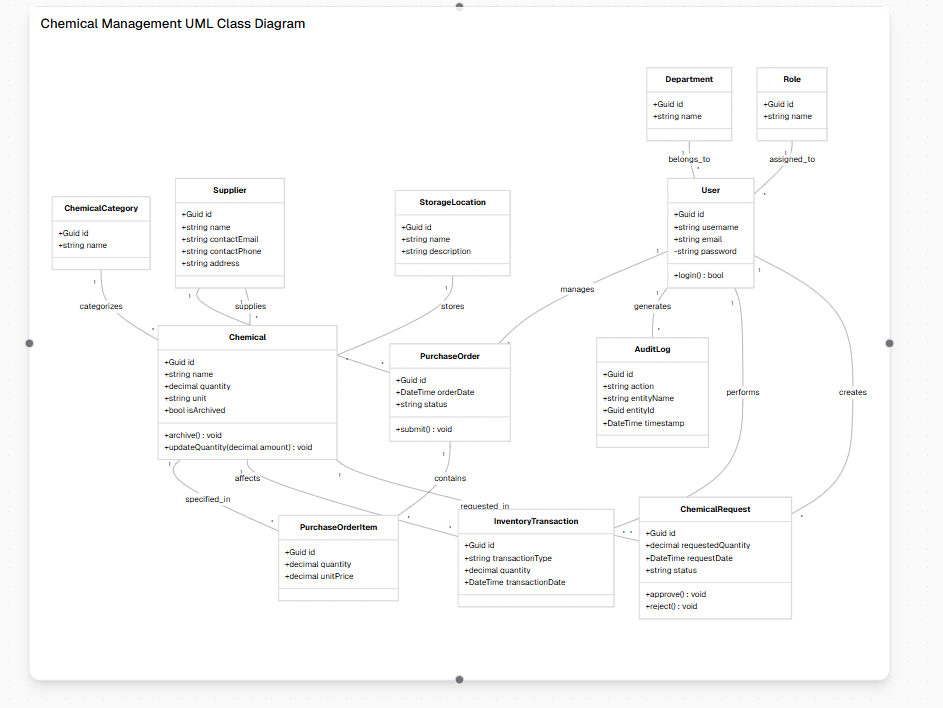

# Class Diagram – Laboratory Management System

Ky dokument përshkruan **të gjitha klasat, atributet dhe relacionet** për sistemin e menaxhimit të laboratorit kimik.

---

## 1. Chemical
- **Atributet (private)**
  - id: Guid
  - name: string
  - quantity: decimal
  - unit: string
  - categoryId: Guid
  - supplierId: Guid
  - storageLocationId: Guid
  - isArchived: bool

- **Metodat (public)**
  - UpdateQuantity()
  - Archive()

- **Relacionet**
  - Chemical 1 --- * ChemicalRequest
  - Chemical 1 --- * InventoryTransaction
  - Chemical 1 --- * PurchaseOrderItem

---

## 2. ChemicalCategory
- **Atributet**
  - id: Guid
  - name: string

- **Relacionet**
  - ChemicalCategory 1 --- * Chemical

---

## 3. Supplier
- **Atributet**
  - id: Guid
  - name: string
  - contactEmail: string
  - contactPhone: string
  - address: string

- **Relacionet**
  - Supplier 1 --- * Chemical
  - Supplier 1 --- * PurchaseOrder

---

## 4. StorageLocation
- **Atributet**
  - id: Guid
  - name: string
  - description: string

- **Relacionet**
  - StorageLocation 1 --- * Chemical

---

## 5. User
- **Atributet**
  - id: Guid
  - username: string
  - email: string
  - password: string
  - roleId: Guid
  - departmentId: Guid

- **Relacionet**
  - User 1 --- * ChemicalRequest
  - User 1 --- * InventoryTransaction
  - User 1 --- * AuditLog
  - User 1 --- * PurchaseOrder

---

## 6. Role
- **Atributet**
  - id: Guid
  - name: string

- **Relacionet**
  - Role 1 --- * User

---

## 7. Department
- **Atributet**
  - id: Guid
  - name: string

- **Relacionet**
  - Department 1 --- * User

---

## 8. ChemicalRequest
- **Atributet**
  - id: Guid
  - chemicalId: Guid
  - requestedByUserId: Guid
  - requestedQuantity: decimal
  - requestDate: DateTime
  - status: string

- **Relacionet**
  - ChemicalRequest * --- 1 Chemical
  - ChemicalRequest * --- 1 User

---

## 9. InventoryTransaction
- **Atributet**
  - id: Guid
  - chemicalId: Guid
  - transactionType: string
  - quantity: decimal
  - transactionDate: DateTime
  - performedById: Guid

- **Relacionet**
  - InventoryTransaction * --- 1 Chemical
  - InventoryTransaction * --- 1 User

---

## 10. AuditLog
- **Atributet**
  - id: Guid
  - action: string
  - entityName: string
  - entityId: Guid
  - performedById: Guid
  - timestamp: DateTime

- **Relacionet**
  - AuditLog * --- 1 User

---

## 11. PurchaseOrder
- **Atributet**
  - id: Guid
  - supplierId: Guid
  - orderDate: DateTime
  - status: string
  - orderedByUserId: Guid

- **Relacionet**
  - PurchaseOrder * --- 1 Supplier
  - PurchaseOrder * --- 1 User
  - PurchaseOrder 1 --- * PurchaseOrderItem

---

## 12. PurchaseOrderItem
- **Atributet**
  - id: Guid
  - purchaseOrderId: Guid
  - chemicalId: Guid
  - quantity: decimal
  - unitPrice: decimal

- **Relacionet**
  - PurchaseOrderItem * --- 1 PurchaseOrder
  - PurchaseOrderItem * --- 1 Chemical

---

# Relacionet Kryesore (Summary)
- Chemical 1 --- * ChemicalRequest
- Chemical 1 --- * InventoryTransaction
- Chemical 1 --- * PurchaseOrderItem
- User 1 --- * ChemicalRequest
- User 1 --- * InventoryTransaction
- User 1 --- * AuditLog
- User 1 --- * PurchaseOrder
- Supplier 1 --- * Chemical
- Supplier 1 --- * PurchaseOrder
- ChemicalCategory 1 --- * Chemical
- StorageLocation 1 --- * Chemical
- Role 1 --- * User
- Department 1 --- * User
- PurchaseOrder 1 --- * PurchaseOrderItem

---
## Diagram UML

